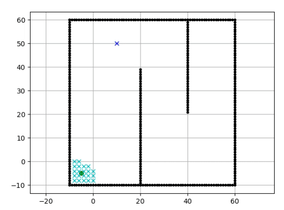
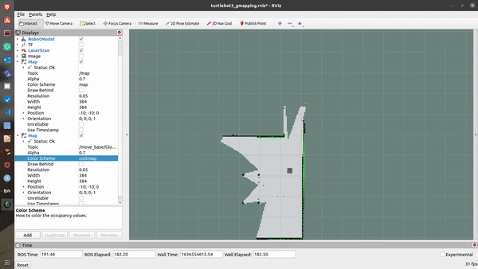

A navegação é uma funcionalidade importante para a robótica móvel. Esta funcionalidade, como o próprio nome já sugere, permite aos robôs móveis a capacidade de se deslocar em ambientes, externos e/ou internos. A navegação comunalmente pode ser realizada por teleoperação ou de forma autônoma. Na teleoperação, há necessidade de um humano realizar o controle de movimento dos robôs móveis, em outras palavras, por meio de um joystick ou um instrumento de comunicação, um operador  guia o robô. Na navegação autônoma, não há presença humana  no deslocamento do robô.
 
A navegação autônoma acontece quando alguma implementação lógica realiza todo o trabalho que seria realizado por ações humanas. A implementação lógica costuma ser realizada através de algoritmos. Neste post será apresentado a navegação autônoma usando algoritmo Dijkstra no robô Turtlebot 3 Waffle Pi.

### Um pouco sobre o Turtlebot 3

{:.center}

O Turtlebot 3 Waffle Pi é um robô desenvolvido pela Robotis. É um robô de
pequeno porte, projetado para operar em locais internos
para fins educacionais. O sistema de sensoriamento do Turtlebot 3 possui uma Raspberry Pi camera, lidar, imu e dois encoders. A atuação é desempenhada por dois servomotores. O robô também tem uma placa de processamento Raspberry, que é responsável pelos processamento da maioria dos algoritmos do robô. O Turtlebot 3 é desenvolvido para operar usando ROS, o que possibilita  a implementação de diversas  funcionalidades. O ROS detêm o pacote de software [move_base](http://wiki.ros.org/move_base) que permite a implementação da navegação autônoma de robôs diferenciais. O pacote move_base usa o algoritmo Dijkstra como padrão, mas outras lógicas podem ser implementadas. 

### Um pouco sobre o Algoritmo Dijkstra
 
o algoritmo Dijkstra é capaz de obter uma trajetória entre
dois pontos em ambiente plano. Esses dois nós podem ser vistos como pontos distintos no ambiente. De um certo nó no
espaço, o algoritmo Dijkstra obtem a partir de todos nós disponíveis uma trajetória para o outro nó, o objetivo. Os gifs abaixo apresentam a aplicação desta técnica desenvolvida em Python por [Atsushi Sakai](https://iopscience.iop.org/article/10.1088/1757-899X/705/1/012037/pdf). A parte em azul são os nós, locais no ambiente, que já
foram explorados. É possível observar que a uma região em azul aumenta à medida que procura pela trajetória continua. Quando o ponto final, o objetivo, é encontrado, temos o trajeto a ser percorrido pelo robô.

{:.center}

 

{:.center}

 

### Navegação
 
Agora  que o Turtlebot 3 e e o algoritmo Dijkstra já foram citados. Podemos falar da navegação que foi implementada. A aplicação foi realizada em dois tipos de ambientes: simulado e real. Na simulação, o robô inicialmente não conhecia o mapa. Para adquirir dados do mapa foi utilizada a técnica SLAM que permite a criação de um mapa do ambiente e a obtenção da localização do robô de forma simultânea. Existe vários algoritmo que realizam  SLAM, o que foi ultilizado na navegação foi o GMAPPING. Um exemplo da aplicação de SLAM usando o algoritmo GMAPPING é demonstrado no projeto [APEREA](https://mhar-vell.github.io/rasc/2021-07-28-aperea-slam/). Com os dados do mapa, o sistema robótico passa a notar os possivéis obstáculos que podem esta presentes no espaço.
 
No ambiente real, o robô inicia a execução da navegação com o conhecimento do mapa. Os dados do mapa foram obtidos usando SLAM. Desta vez foi usado o pacote de software AMCL do ROS. O AMCl, Adaptive Monte Carlo Localization, é um técnica de localização probabilística dedicada a robôs que se deslocam em planos 2D. Esta técnica utiliza dados sobre a localização do robô com os dados do mapa do ambiente. No Turtebot, os dados de localização são obtidos por sensores per encoders e IMU. P

### Resultados
 
Na simulação e com auxílio do SLAM, o Turtlebot teve sucesso ao alcançar o objetivo. Vale considerar que nesta aplicação o robô não tem, inicialmente, nenhum conhecimento do ambiente.
 
 
No ambiente real e com auxílio da aplicação do AMCL, o robô também teve sucesso com a navegação. O Turtlebot enfrentou algumas dificuldades ao contornar os obstáculos.
 
{:.center}

 
 
Com o AMCL, o robô teve sucesso quanto a navegação  no ambiente real, apesar de enfrentar dificuldades ao contornar as extremidades das paredes. O Sucesso foi em razão da tecnica AMCL usar o mapa completo do ambiente e assim o algoritmo Dijskstra pode obter a trajetória até o objetivo desde o momento inicial da navegação. As dificuldades para passar pelas extremidades podem ser vencidas os parâmetros dedicados à trajetória para evitar obstáculos.
 
{:.center}

 
 
A aplicação da navegação autônoma no Turtlebot 3 Waffle Pi foi bastante interessante já que esta funcionalidade é preciosa para a robótica, além de usar técnicas que são impoertantes para o desenvolvimento de sistemas autônomos móveis, ao exemplo do SLAM e do AMCL. Também vale notar que o algoritmo Dijstra pode ser utilizados em UGV de médio e grande porte com sucesso. 

## O repositório

Este [link](https://github.com/Brazilian-Institute-of-Robotics/bir_turtlebot_expl-dijkstra) possui os o workspace do desenvolvimento que foi apresentado. O Readme possui as informações  para a instalações dos pacotes necessários realização do SLAM, navegação autônoma  e teleoperação utilizando um joystick.

 

---------------------
 

<!-- autor -->

<h3 class="post-title">Autor</h3> 

  

    <table class="table-borderless highlight">
      <thead>
        <tr>
          <th></th>
        </tr>
      </thead>
      <tbody>
        <tr class="font-weight-bolder" style="text-align: center margin-top: 0">
          <td>Matheus Anselmo</td>
        </tr>
        <tr style="text-align: center" >
          <td style="vertical-align: top"><small>Pesquisador Jr. do projeto  Engenheiro de Controle e Automação.</small></td>
          <td></td>
        </tr>
      </tbody>
    </table>
  

 

